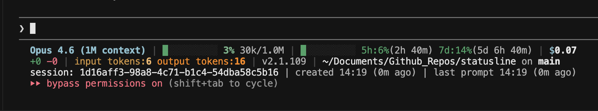
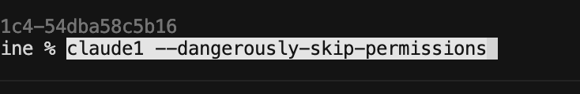
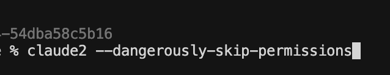

# Claude Code Status Line + Multi-Account Aliases

Two tools for [Claude Code](https://claude.ai/claude-code) power users:

1. **Status line** — richer info bar (model, context bar, rate limits, cost, tokens, git branch)
2. **Multi-account aliases** — `claude1`, `claude2`, … isolated instances to cycle between Max subscriptions and distribute rate limits

---

## Status Line



**Line 1:** model · context bar + % + tokens · 5h/7d rate limits with reset timers · session cost
**Line 2:** lines +/- · cumulative input/output tokens · version · cwd + git branch

Rate limits are cached to `/tmp/.claude-rate-limits-cache.json` so they persist across refreshes.

### Install

See [setup-guide.md](setup-guide.md) for manual steps, or paste [setup-prompt.md](setup-prompt.md) into Claude Code to install automatically.

Requires `jq` (`brew install jq` / `sudo apt install jq`).

---

## Multi-Account Aliases

Run isolated Claude Code instances, each with its own auth, sharing settings/skills/plugins via symlinks. The default `claude` command stays untouched.




```bash
claude                                    # default account
claude1 --dangerously-skip-permissions    # account A
claude2 --dangerously-skip-permissions    # account B
```

### Install

Full walkthrough: [setup-aliases-claude-code-guide.md](setup-aliases-claude-code-guide.md).
Agent prompt (automated): [setup-aliases-claude-code-prompt.md](setup-aliases-claude-code-prompt.md).
